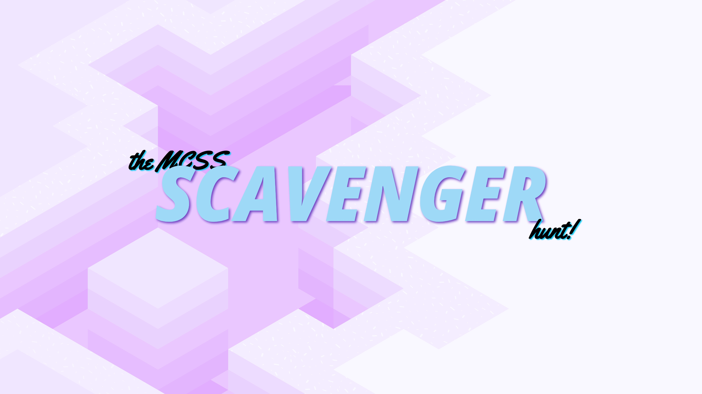

# scavenger

> scavenger hunt challenges for mcss sHunt

## Usage

- Pass in the `/?id={id_value}` parameter in the URL to query the backend for the corresponding challenge with the given ID

## Built With

- Bootstrap Studio
- Visual Studio Code
